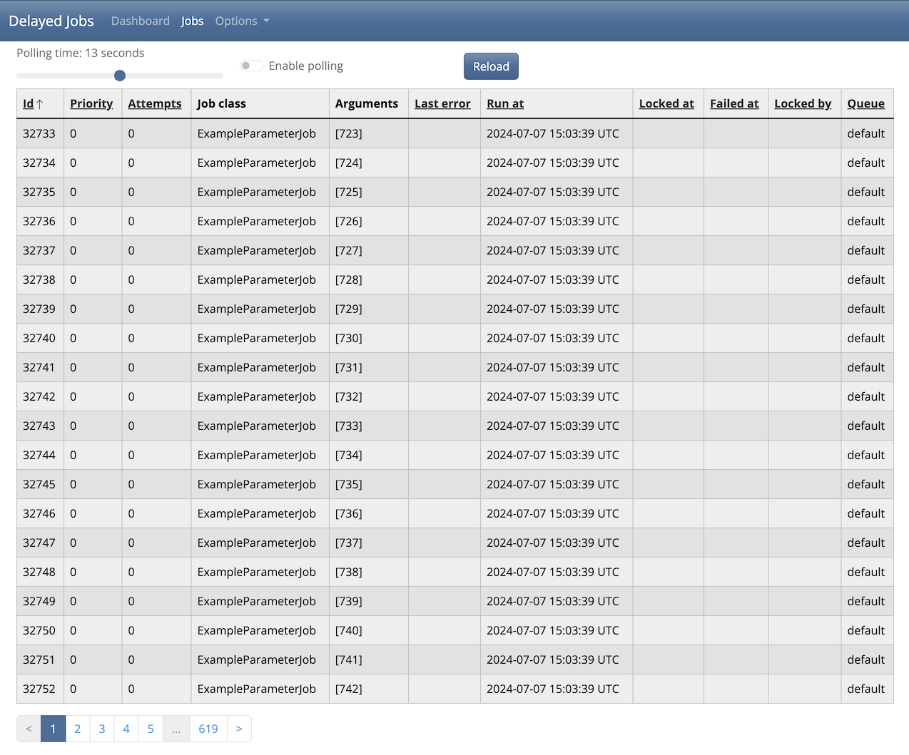

# RushJob
User interface for Delayed Job (https://github.com/collectiveidea/delayed_job) in Ruby on Rails 





### Note
 - This has only been tested with SQLite and Postgresql.
 - This app uses cookies to store the dark mode selection.

## Usage
You will need Delayed Job, `delayed_job`, and Delayed Job ActiveRecord, `delayed_job_active_record`, installed in a Ruby on Rails application for this gem to work properly.

Navigate to the `/rush_job` route in your application to see the Delayed Jobs. Locally this would be `http://localhost:3000/rush_job`

## Installation
Add this line to your Ruby on Rails application's Gemfile:

```ruby
gem 'rush_job', '~> 1.2'
```

And then execute:
```bash
$ bundle install
```

Add the following to your `config/routes.rb` file:
```ruby
mount RushJob::Engine => '/rush_job'
```

## Contributing
Open an issue or
  1. Fork
  2. Update
  3. Test
      1. `bundle exec rails app:test:all` and check coverage in `test/coverage/index.html`
      2. `bundle exec rubocop`
      3. `bundle exec brakeman`
  4. Open pull request

## Propshaft
This gem uses propshaft, https://github.com/rails/propshaft, and uses a CDN for Bootstrap CSS https://www.jsdelivr.com/package/npm/bootswatch

For the previous bundled CSS and sprockets frok from v1.2.0

## Turbo
This gem uses turbo-rails, https://github.com/hotwired/turbo-rails. For Rails UJS fork from v0.6.1

## License
The gem is available as open source under the terms of the [MIT License](https://opensource.org/licenses/MIT).
